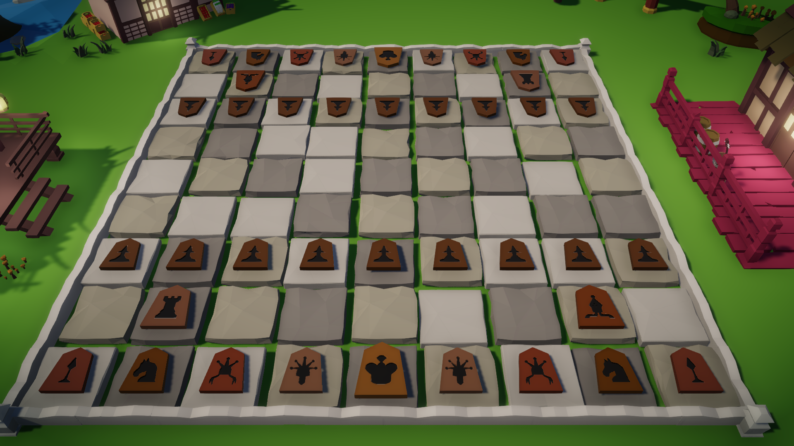
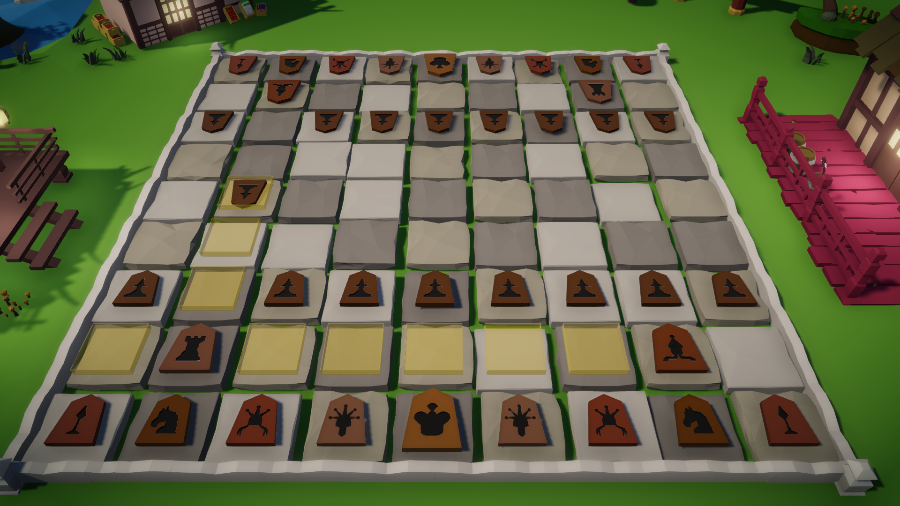
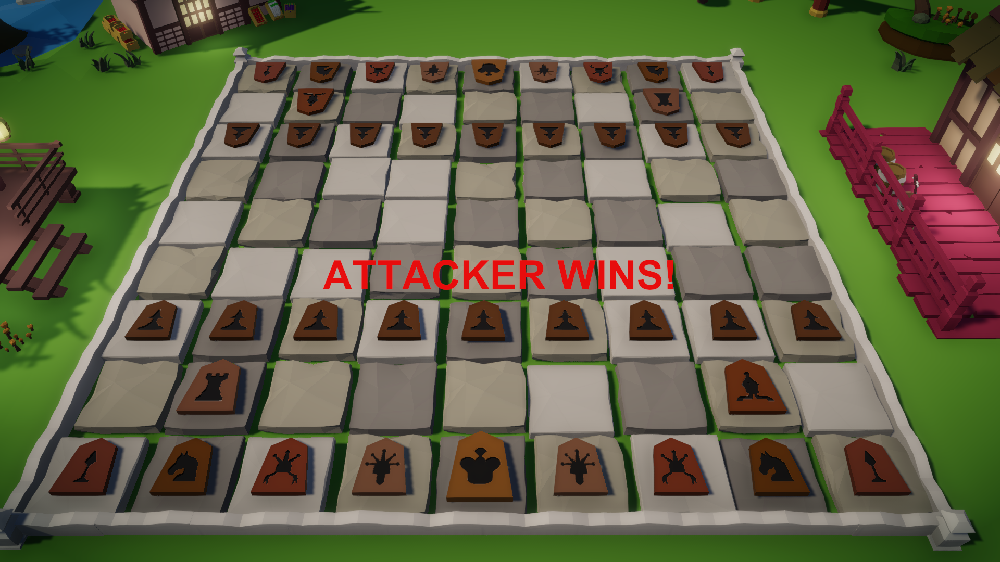

# Shogi-Master
## "Japanese chess" game made in Unity
 
You can try game with exe file inside Game directory. 
You can move the camera with WASD keys. Use the mouse to move pieces

 
Yellow boxes highlight possible moves with chosen piece

 
After one King is beaten, the game is over

